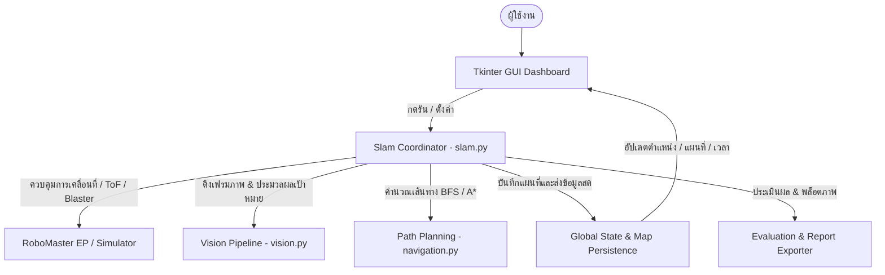

# 🤖 RoboMaster Autonomous SLAM & Blaster Navigation System
> **Assignment 2 / Final Project**: ระบบสำรวจเขาวงกตอัตโนมัติ สร้างแผนที่ (SLAM), ตรวจจับเป้าหมายสีและรูปทรง และนำทางยิงกระสุนเจลด้วยอัลกอริทึม A* สำหรับหุ่นยนต์ **DJI RoboMaster EP**

[](https://www.python.org/)
[](https://www.dji.com/robomaster-ep)
[](https://opencv.org/)
[]()

---

## 📌 สารบัญ (Table of Contents)
1. [ภาพรวมของระบบ (Overview)](#-ภาพรวมของระบบ-overview)
2. [สถาปัตยกรรมการทำงาน 2 รอบ (Dual-Round Architecture)](#-สถาปัตยกรรมการทำงาน-2-รอบ-dual-round-architecture)
   - [รอบที่ 1: การเดินสำรวจและสร้างแผนที่ (SLAM Mapping & Discovery)](#-รอบที่-1-การเดินสำรวจและสร้างแผนที่-slam-mapping)
   - [รอบที่ 2: การนำทางและยิงเป้าหมาย (A* Navigation & Precision Blasting)](#-รอบที่-2-การนำทางและยิงเป้าหมาย-a-navigation--blasting)
   - [โหมดรันต่อเนื่อง (Continuous Mode)](#-โหมดรันต่อเนื่อง-continuous-mode)
3. [ระบบจับเวลาภารกิจแต่ละรอบ (Mission Stopwatch System)](#-ระบบจับเวลาภารกิจแต่ละรอบ-mission-stopwatch-system)
4. [โครงสร้างโค้ดและโมดูล (Code Structure & Modules)](#-โครงสร้างโค้ดและโมดูล-code-structure--modules)
5. [อัลกอริทึมและการประมวลผล (Algorithms & Pipeline)](#-อัลกอริทึมและการประมวลผล-algorithms--pipeline)
   - [การตรวจจับกำแพงและการปรับกึ่งกลางช่อง (Wall Sensing & Recenter)](#การตรวจจับกำแพงและการปรับกึ่งกลางช่อง)
   - [การประมวลผลภาพและตรวจจับเป้าหมาย (Computer Vision)](#การประมวลผลภาพและตรวจจับเป้าหมาย-computer-vision)
   - [การวางแผนเส้นทาง (Path Planning: BFS & A*)](#การวางแผนเส้นทาง-path-planning)
6. [การติดตั้งและข้อกำหนดของระบบ (Installation & Requirements)](#-การติดตั้งและข้อกำหนดของระบบ-installation)
7. [วิธีใช้งานระบบ (Usage Guide)](#-วิธีใช้งานระบบ-usage-guide)
   - [การรันในโหมดจำลอง (Simulation Mode)](#1-โหมดจำลอง-simulation-mode-ไม่ใช้หุ่นยนต์จริง)
   - [การรันกับหุ่นยนต์จริง (Physical Robot Mode)](#2-โหมดหุ่นยนต์จริง-physical-robomaster-mode)
   - [คำสั่งผ่าน Terminal (Command Line Interface)](#3-ตัวเลือกผ่าน-command-line-args)
8. [คู่มือหน้าจอ Dashboard (GUI Dashboard Guide)](#-คู่มือหน้าจอ-dashboard-gui-guide)
9. [ผลลัพธ์และรายงานการทำงาน (Outputs & Evaluation)](#-ผลลัพธ์และรายงานการทำงาน-outputs--evaluation)

---

## 🌟 ภาพรวมของระบบ (Overview)

โปรเจกต์นี้เป็นการพัฒนาระบบควบคุมหุ่นยนต์ **DJI RoboMaster EP** เพื่อปฏิบัติภารกิจอัตโนมัติในพื้นที่เขาวงกตแบบกริด (ค่าเริ่มต้น 6×6 ช่อง ขนาดช่องละ 0.60 ม.) โดยมีจุดเด่นดังนี้:
- **ทำงานอัตโนมัติเต็มรูปแบบ (Fully Autonomous)** โดยไม่ต้องควบคุมด้วยมือ
- **ระบบสถาปัตยกรรมแบบ 2 รอบ (Dual-Round Architecture)**: รอบสำรวจทำแผนที่ (SLAM) และรอบนำทางความเร็วสูงเข้ายิงเป้าหมาย (A*)
- **ระบบปรับจูนกึ่งกลางช่องอัจฉริยะ (Mecanum Centering & IMU Alignment)** ป้องกันการดริฟต์สะสมของล้อ Mecanum
- **ระบบตรวจจับเป้าหมายด้วย Computer Vision (HSV & Contour Analysis)** จำแนก 4 สี (แดง, น้ำเงิน, เขียว, เหลือง) และ 4 รูปทรง (วงกลม, สี่เหลี่ยมจัตุรัส, แถบแนวนอน, แถบแนวตั้ง)
- **ระบบจับเวลาภารกิจแต่ละรอบ (Stopwatch)** เริ่มนับเวลาทันทีที่กดรัน บันทึกเวลาแยกรอบ 1, รอบ 2 และเวลารวม
- **หน้าจอ Dashboard สด (Tkinter GUI)** แสดงผลแผนที่ ตำแหน่งหุ่น ทิศทางกล้อง ภาพกล้องสด แกลเลอรีภาพถ่ายเป้าหมาย และระบบโหลดแผนที่ CSV



---

## 🔄 สถาปัตยกรรมการทำงาน 2 รอบ (Dual-Round Architecture)

### 🗺️ รอบที่ 1: การเดินสำรวจและสร้างแผนที่ (SLAM Mapping)
1. **เริ่มต้นที่จุด Start Config**: กำหนดพิกัด $(X, Y)$ และทิศทางเริ่มต้น (NORTH, EAST, SOUTH, WEST)
2. **การสำรวจรอบตัว (3-Direction Scanning)**:
   - หุ่นยนต์ใช้กิมบอลหมุนสแกน 3 ทิศทาง: **หน้า (Front)**, **ขวา (Right)**, และ **ซ้าย (Left)**
   - อ่านระยะเซนเซอร์ ToF เพื่อตรวจหากำแพงโฟม (ระยะ $\le 550\text{ mm}$ นับเป็นกำแพง)
   - เปิดกล้องวิเคราะห์ภาพหาเป้าหมาย หากพบจะบันทึกพิกัดช่อง, ทิศทาง, สี, รูปทรง และบันทึกภาพถ่าย Snapshot
3. **การวางแผนเดินสำรวจ (BFS Frontier Exploration)**:
   - ใช้ Breadth-First Search ค้นหาช่องว่างที่ยังไม่เคยสำรวจ (Unvisited / Discovered Cells) ที่อยู่ใกล้ที่สุด
   - เคลื่อนที่ทีละ 1 ช่อง พร้อมระบบล็อกทิศทางด้วย IMU Attitude และปรับกึ่งกลางช่อง (Recenter)
4. **การบันทึกแผนที่อัตโนมัติ (Autosave)**:
   - บันทึกสถานะแผนที่และเป้าหมายลงไฟล์ `maps/mission_map.json` อย่างต่อเนื่อง
   - เมื่อสำรวจครบทุกช่อง หุ่นยนต์จะเดินกลับมายังจุดเริ่มต้น $(X_{start}, Y_{start})$

### ⭐ รอบที่ 2: การนำทางและยิงเป้าหมาย (A* Navigation & Blasting)
1. **โหลดแผนที่ (Map Loading)**:
   - โหลดข้อมูลกำแพงและตำแหน่งเป้าหมายทั้งหมดจาก `maps/mission_map.json` (หรือโหลดจากไฟล์ CSV)
2. **การจัดลำดับเป้าหมายและวางแผนเส้นทางสั้นที่สุด (A* Algorithm)**:
   - ใช้อัลกอริทึม A* พร้อม **Turn Penalty (ค่าน้ำหนักการเลี้ยว)** เพื่อเลือกเส้นทางที่สั้นที่สุดและเลี้ยวน้อยที่สุด
   - เดินตรงไปยังช่องเป้าหมายโดยไม่จำเป็นต้องแวะช่องอื่นที่ไม่เกี่ยวข้อง
3. **การเล็งและยิงเป้าหมายอัตโนมัติ (Precision Gimbal Aiming & Firing)**:
   - เมื่อถึงช่องเป้าหมาย หุ่นยนต์จะหันกิมบอลเข้าหาเป้าหมาย
   - ใช้อัลกอริทึม Visual Servoing ปรับ Yaw/Pitch ให้อยู่กึ่งกลางเป้าหมายอย่างแม่นยำ
   - สั่งยิงกระสุนเจล (Water Gel Beads) จำนวน 2 นัด
   - ถ่ายภาพยืนยันการยิงสำเร็จ (`_hit.jpg`) และส่งเข้าแกลเลอรี
4. **เดินกลับจุดเริ่มต้น (Return-to-Home)**:
   - เมื่อยิงเป้าหมายครบถ้วน คำนวณเส้นทาง A* เดินกลับจุดเริ่มต้นและหันหน้าสู่ทิศทางเดิมอย่างสมบูรณ์

### 🚀 โหมดรันต่อเนื่อง (Continuous Mode)
- กดปุ่ม **"🚀 รันต่อเนื่อง (รอบ 1 SLAM ➔ รอบ 2 A*)"**
- ระบบจะทำความสะอาดข้อมูลเก่า และเริ่มเดินรอบที่ 1 ทันที
- เมื่อรอบที่ 1 สำรวจเสร็จสิ้นและกลับถึงจุดเริ่มต้น ระบบจะสลับเข้ารอบที่ 2 อัตโนมัติโดยไม่ต้องกดปุ่มใดๆ เพิ่มเติม

---

## ⏱️ ระบบจับเวลาภารกิจแต่ละรอบ (Mission Stopwatch System)

ระบบจับเวลาถูกออกแบบมาเพื่อรองรับการแข่งขันและการทดสอบสมรรถนะ:
- **Zero Latency Start**: ทันทีที่คลิกปุ่มรัน ปุ่มใดปุ่มหนึ่ง นาฬิกาจับเวลาดิจิทัลจะเริ่มนับทันทีในระดับเสี้ยววินาที (`00:00.0`)
- **การเก็บบันทึกเวลาแบบแยกรอบ**:
  - `🗺️ รอบ 1 (SLAM)`: เวลาที่ใช้ในการสำรวจเขาวงกตจนครบ
  - `⭐ รอบ 2 (A*)`: เวลาที่ใช้ในการเดินทางไปยิงเป้าหมายจนครบและกลับจุดเริ่ม
  - `⌛ เวลารวม`: ผลรวมเวลาทั้งหมดตั้งแต่เริ่มภารกิจ
- **การสลับรอบอัตโนมัติ**: เมื่อจบรอบที่ 1 ในโหมดรันต่อเนื่อง เวลาของรอบ 1 จะถูกล็อกพร้อมเครื่องหมาย `✅` และเริ่มจับเวลารอบที่ 2 ต่อเนื่องทันที
- **แสดงผลแบบ Multi-View**: แสดงผลทั้งในการ์ด Stopwatch หลัก, ในแถบสถานะด้านล่างแผนที่ และสรุปลงใน Mission Log เมื่อจบภารกิจ

---

## 📂 โครงสร้างโค้ดและโมดูล (Code Structure & Modules)

```
slam-main/
│
├── run.py                 # สคริปต์หลักสำหรับรันโปรแกรม (CLI Entry Point)
├── slam.py                # ตัวควบคุมหลักของภารกิจ (Mission Coordinator, State Machine, Loops)
├── dashboard.py           # หน้าจอ GUI Dashboard (Tkinter) แผนที่สด กล้อง ตัวจับเวลา แกลเลอรี
├── navigation.py          # อัลกอริทึมการเดิน (BFS Exploration, A* Path Planning with Turn Penalty)
├── robot_control.py       # คลาสควบคุมฮาร์ดแวร์ RoboMaster EP (Chassis, Gimbal, Blaster, ToF, IMU)
├── vision.py              # ระบบประมวลผลภาพ (HSV Filter, Shape Detection, Gimbal Aiming, Snapshot)
├── vision_preview.py      # เครื่องมือเปิดกล้องทดสอบและปรับจูน Calibration สี/เป้าหมาย
├── config.py              # ค่าคงที่ คอนฟิกูเรชัน ขนาดตาราง ความเร็ว และพารามิเตอร์เซนเซอร์
├── state.py               # โครงสร้างตัวแปรสถานะส่วนกลาง (State Management)
├── evaluation.py          # การประเมินผลคำนวณ Accuracy/Coverage และสร้างภาพ Trajectory Map
│
├── maps/
│   └── mission_map.json   # แผนที่ที่สำรวจได้ (กำแพง, ช่องที่เดิน, ข้อมูลเป้าหมาย) สำหรับรันรอบ 2
│
└── results/               # โฟลเดอร์เก็บผลลัพธ์ทั้งหมด
    ├── targets/           # ภาพถ่ายสแนปช็อตของเป้าหมายที่ตรวจพบและยิง
    ├── exploration_log.csv# ประวัติพิกัดการเดินและค่าเซนเซอร์ทุกก้าว
    ├── trajectory_log.csv # เส้นทางการเคลื่อนที่ของหุ่นยนต์
    ├── visited_cells.csv  # รายการช่องที่สำรวจสำเร็จ
    ├── walls_data.csv     # พิกัดแนวกำแพงแนวนอน (H) และแนวตั้ง (V)
    ├── signs_data.csv     # รายละเอียดเป้าหมายที่ตรวจพบ (สี, ทรง, พิกัด, ทิศทาง)
    ├── mission_log.txt    # บันทึกเหตุการณ์และ Log การทำงานทั้งหมด
    └── robot_trajectory.png# ภาพสรุปแผนที่และเส้นทางการเดินความละเอียดสูง
```

---

## 🧠 อัลกอริทึมและการประมวลผล (Algorithms & Pipeline)

### การตรวจจับกำแพงและการปรับกึ่งกลางช่อง
- **ToF Median Filter**: เซนเซอร์วัดระยะ ToF อ่านค่าความถี่ 10 Hz โดยนำเข้าตัวกรอง Median Filter ขนาด 5 ตัวอย่าง เพื่อตัด Noise และค่าสะท้อนผิดพลาด
- **Wall Decision Threshold**: ระยะวัด $\le 550\text{ mm}$ ระบุว่ามีกำแพงโฟมกั้นระหว่างช่อง (หากเป็นช่องโล่งระยะจะ $\ge 700\text{ mm}$)
- **Mecanum Drift Recenter**: เนื่องจากล้อ Mecanum เกิดการไถล (Slip) ได้ง่าย ระบบจะวัดระยะกำแพงซ้าย-ขวา หากพบกำแพงจะสั่งเคลื่อนที่สไลด์ด้านข้าง (Strafe) เข้าหากึ่งกลาง และจัดระยะห่างกำแพงหน้า 200 mm โดยมี Deadband 20 mm ป้องกันการสั่นไหว

### การประมวลผลภาพ (Computer Vision)
1. **Color Thresholding (HSV Space)**: แยกสีเป้าหมายตามช่วงสี HSV:
   - 🔴 **Red**: รองรับ 2 ช่วงสี ($[0-10]$ และ $[165-180]$)
   - 🔵 **Blue**: ช่วงสี $[95-130]$
   - 🟢 **Green**: ช่วงสี $[35-85]$
   - 🟡 **Yellow**: ช่วงสี $[18-38]$
2. **Contour Analysis & Shape Classification**:
   - คำนวณความกลม (Circular Metric: $4\pi \times \frac{\text{Area}}{\text{Perimeter}^2}$) $\ge 0.70$ และ Convexity $\ge 0.85$ $\rightarrow$ **Circle**
   - คำนวณ Aspect Ratio ($W/H$):
     - ใกล้เคียง 1.0 ($0.75 - 1.30$) $\rightarrow$ **Square**
     - แนวนอน ($> 1.35$) $\rightarrow$ **Horizontal Bar**
     - แนวตั้ง ($< 0.75$) $\rightarrow$ **Vertical Bar**
3. **Multi-Frame Stability Voting**: ป้องกัน False Positive โดยต้องตรวจพบเป้าหมายสีและทรงเดิมอย่างน้อย 2-3 เฟรมต่อเนื่อง จึงจะบันทึกเป็นเป้าหมายจริง

### การวางแผนเส้นทาง (Path Planning)
- **BFS (Breadth-First Search)** ในรอบที่ 1: ค้นหาเส้นทางที่ผ่านช่องที่เคยเดินแล้วไปยังช่องใหม่ที่ยังไม่เคยไป (Frontier)
- **A\* Algorithm with Turn Penalty** ในรอบที่ 2:
  $$f(n) = g(n) + h(n) + \text{Turn Penalty}$$
  โดย $g(n)$ คือระยะทางจริง, $h(n)$ คือระยะทางแมนฮัตตันไปยังเป้าหมาย และเพิ่มโทษ $\text{Turn Penalty}$ ทุกครั้งที่มีการเปลี่ยนทิศทาง เพื่อให้หุ่นยนต์เลือกทางตรงมากกว่าทางเลี้ยว ช่วยลดความคลาดเคลื่อนสะสมของล้อ

---

## 💻 การติดตั้งและข้อกำหนดของระบบ (Installation)

### ข้อกำหนด
- **ระบบปฏิบัติการ**: Windows 10/11, macOS, หรือ Ubuntu Linux
- **Python**: เวอร์ชัน 3.8, 3.9 หรือ 3.10 (แนะนำ 3.8/3.9 สำหรับ RoboMaster SDK)
- **การเชื่อมต่อ**: Wi-Fi เชื่อมต่อไปยังหุ่นยนต์ RoboMaster EP (โหมด Direct AP หรือ Router Mode)

### ขั้นตอนการติดตั้ง
1. Clone โปรเจกต์ลงในเครื่อง:
   ```bash
   git clone https://github.com/Praewa-Japan1350/final-project.git
   cd final-project
   ```

2. สร้าง Virtual Environment และเปิดใช้งาน:
   ```bash
   # Windows (PowerShell)
   python -m venv .venv
   .\.venv\Scripts\Activate.ps1
   ```

3. ติดตั้งไลบรารีที่จำเป็น:
   ```bash
   pip install robomaster opencv-python pillow numpy matplotlib
   ```

---

## 🚀 วิธีใช้งานระบบ (Usage Guide)

### 1. โหมดจำลอง (Simulation Mode) - ไม่ใช้หุ่นยนต์จริง
เหมาะสำหรับการทดสอบอัลกอริทึม, แผนที่, ตรรกะการเดิน และหน้าจอ Dashboard โดยไม่ต้องเชื่อมต่อหุ่นยนต์:
```bash
python run.py --sim
```

### 2. โหมดหุ่นยนต์จริง (Physical RoboMaster Mode)
1. เปิดเครื่องหุ่นยนต์ DJI RoboMaster EP
2. สับสวิตช์โหมดการเชื่อมต่อที่ตัวหุ่นยนต์ไปที่ตำแหน่ง **Direct Connection (Wi-Fi AP)**
3. เชื่อมต่อ Wi-Fi ของคอมพิวเตอร์เข้ากับ Wi-Fi ของหุ่นยนต์ (เช่น `RM_EP_XXXXXX`)
4. รันคำสั่ง:
   ```bash
   python run.py
   ```

### 3. ตัวเลือกผ่าน Command Line (CLI Args)
| Argument | คำอธิบาย | ตัวอย่าง |
|---|---|---|
| `--sim` | รันในโหมดจำลอง (Simulation) | `python run.py --sim` |
| `--no-dashboard` | รันแบบไม่มีหน้าต่าง GUI (Terminal อย่างเดียว) | `python run.py --sim --no-dashboard` |
| `--start-x` | กำหนดแกน X เริ่มต้น (1 ถึง 6) | `python run.py --start-x 1` |
| `--start-y` | กำหนดแกน Y เริ่มต้น (1 ถึง 6) | `python run.py --start-y 1` |
| `--start-heading` | ทิศทางหันหน้าเริ่มต้น (`NORTH`, `EAST`, `SOUTH`, `WEST`) | `python run.py --start-heading NORTH` |
| `--mode` | โหมดการทำงาน (`slam`, `astar`, `all`) | `python run.py --mode all` |
| `--eval` | ประเมินผลรายงานซ้ำจากไฟล์ที่เคยบันทึกไว้ | `python run.py --eval` |

---

## 🖥️ คู่มือหน้าจอ Dashboard (GUI Guide)

หน้าต่าง Dashboard แบ่งการทำงานออกเป็น 2 ฝั่งหลัก:

### 1. ฝั่งซ้าย (Map & Live View)
- **ตารางแผนที่สด (Live Grid Map Canvas)**:
  - ช่องสีเขียว (`VISITED`): ช่องที่หุ่นยนต์เคยเดินผ่านแล้ว
  - ช่องสีฟ้า (`OPEN`): ช่องว่างที่ตรวจพบแล้วแต่ยังไม่ได้เดินเข้าไป
  - ช่องสีขาว (`?`): ช่องที่ยังไม่ทราบข้อมูล
  - เส้นสีแดงเรืองแสง: แนวกำแพงโฟมที่ตรวจพบ
  - วงกลมสีน้ำเงินพร้อมลูกศร: ตำแหน่งและทิศทางการหันหน้าของหุ่นยนต์
  - เส้นลำแสงสีส้ม: ทิศทางการสแกนของกิมบอลแบบเรียลไทม์
  - สัญลักษณ์สี/ทรงในช่อง: เป้าหมายที่ตรวจพบ
- **หน้าต่างกล้องสด (Live Camera Feed)**: แสดงภาพแบบเรียลไทม์พร้อมเครื่องหมายกากบาทเล็งเป้า (Aim Reticle) เมื่อทำการเล็งยิง

### 2. ฝั่งขวา (Control & Telemetry Panel)
- **⚙️ ขนาดแผนที่ & จุดเริ่มต้น**: สามารถปรับขนาดตาราง (เช่น 6×6, 8×8), ขนาดช่อง (เมตร) และเลือกพิกัด/ทิศทางเริ่มต้น (หรือคลิกเลือกช่องบนแผนที่ได้โดยตรง)
- **🎯 เลือกเป้าหมาย & ฟิลเตอร์**: เลือกสี (แดง, น้ำเงิน, เขียว, เหลือง) และรูปทรงเป้าหมายที่อนุญาตให้ยิง
- **ปุ่มควบคุมภารกิจ**:
  - `🗺️ รอบ 1: เดินแบบ SLAM`: เริ่มต้นเฉพาะรอบทำแผนที่
  - `⭐ รอบ 2: เดินแบบ A*`: เริ่มต้นรอบนำทางยิงเป้าหมายตามแผนที่
  - `🚀 รันต่อเนื่อง (รอบ 1 SLAM ➔ รอบ 2 A*)`: ทำงานทั้งสองรอบอัตโนมัติต่อเนื่อง
  - `📂 โหลดแผนที่ CSV`: โหลดไฟล์แผนที่ภายนอกสำหรับรันรอบ 2 ได้ทันที
  - `⏹ หยุดฉุกเฉิน (Stop)`: สั่งหยุดหุ่นยนต์และเซฟข้อมูลทันที
- **⏱️ ระบบจับเวลาภารกิจแต่ละรอบ (Mission Stopwatch)**:
  - หน้าปัดตัวเลขดิจิทัลสด `00:00.0`
  - ป้ายแสดงเวลาแยก `รอบ 1 (SLAM)`, `รอบ 2 (A*)`, และ `เวลารวม`
  - ปุ่ม `🔄 รีเซ็ตเวลา`
- **📊 เมนูผลลัพธ์ & แกลเลอรี**:
  - `📁 Results`: เปิดโฟลเดอร์ผลลัพธ์ในเครื่อง
  - `🗺️ แผนที่สรุป`: แสดงภาพแผนที่ความละเอียดสูง
  - `🖼️ ภาพเป้าหมาย`: เปิดดูภาพ Snapshot ของเป้าหมายทั้งหมดที่ตรวจพบและยิง
- **📋 บันทึกการทำงาน (Mission Event Logs)**: แสดงข้อความแจ้งเตือน พิกัด ค่าเซนเซอร์ และสถานะภารกิจ

---

## 📊 ผลลัพธ์และรายงานการทำงาน (Outputs & Evaluation)

เมื่อจบภารกิจ ระบบจะสร้างไฟล์ผลลัพธ์ในโฟลเดอร์ `results/` โดยอัตโนมัติ:

1. **`final_slam_map.png` / `robot_trajectory.png`**:
   - ภาพพล็อตแผนที่ความละเอียดสูง แสดงแนวตาราง, แนวกำแพงโฟม, จุดเริ่มต้น, จุดสิ้นสุด, เส้นทางการเดินของหุ่นยนต์ (Trajectory Path) และสัญลักษณ์เป้าหมาย
2. **`mission_map.json`** (ในโฟลเดอร์ `maps/`):
   - ไฟล์โครงสร้าง JSON เก็บพิกัดกำแพง, ช่องที่สำรวจแล้ว, และเป้าหมายทั้งหมด พร้อมสำหรับการนำไปรันในรอบที่ 2
3. **ไฟล์ข้อมูล CSV**:
   - `exploration_log.csv`: ข้อมูล Step, เวลา, พิกัด $(X, Y)$, พิกัดจริง (เมตร), ทิศทาง, ค่าระยะ ToF
   - `trajectory_log.csv`: พิกัดเส้นทางทั้งหมดที่หุ่นยนต์เคลื่อนที่
   - `visited_cells.csv`: พิกัดช่องทั้งหมดที่สำรวจแล้ว
   - `walls_data.csv`: รายการกำแพงแนวนอน (H) และแนวตั้ง (V)
   - `signs_data.csv`: รายละเอียดเป้าหมาย (พิกัด, ทิศทาง, สี, ทรง, ขนาดพิกเซล, path ภาพ)
4. **`results/targets/`**:
   - ภาพถ่ายเป้าหมายที่ตรวจพบ (`_det.jpg`)
   - ภาพถ่ายยืนยันการเล็งและยิงกระสุนเจลเข้าเป้า (`_hit.jpg`)

---

## 👥 ผู้พัฒนา (Credits)
- **RoboMaster SLAM Project Team**

6810110096 นายณัฐพนธ แก้วประดับ

6810110097 นายณัฐพล แสงคงเรือง

6810110242 นางสาวแพรวา แก้วเจริญ

6810110566 นายชนาธิป นุ้ยสี

- **Repository**: [Praewa-Japan1350/final-project](https://github.com/Praewa-Japan1350/final-project.git)
